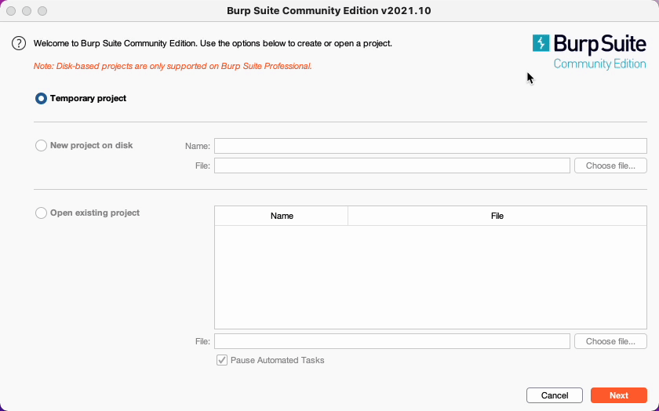

# Burp-Attack-Walkthough
Homework assignment for Cybersecurity Management.

#Attack and Tool Walk Through Using Burp Suite and Web Security Academy

By:
Melanie Guadalupe Najera,
Frank Benavidez,
Cesar Gardea,
Cory Smith.
#
In today's walkthrough, we will navigate to the Port Swigger Web Security Academy hacking labs to conduct a username enumeration and password brute-force attack. We will use the tool named Burp Suite Community Edition to conduct the attack. This is an experience provided to individuals entirely free of charge.

#Pre-Requirements:
There are a few tasks that you will need to do before getting started on hacking the website. 
1.	Create a free Web Security Academy account on the PortSwigger website.
a.	Use this link: https://portswigger.net/web-security
2.	Download and install the free version of Burp Suite. 
a.	Use this link: https://portswigger.net/burp/communitydownload
3.	Install Firefox and the foxy proxy extension.
a.	Firefox: https://www.mozilla.org/en-US/firefox/new/
b.	Foxy Proxy: https://addons.mozilla.org/en-US/firefox/addon/foxyproxy-standard/
4.	Set up Burp Suite to collect traffic. 
a.	Use this link: https://null-byte.wonderhowto.com/how-to/use-burp-foxyproxy-easily-switch-between-proxy-settings-0196630/
5.	You are now ready to hack! So, turn off the lights, grab a hoody, and let's get started!

#Getting Started:

Once you have everything installed, fire up Burp Suite. 

The first interface you are going to see is the initial project options portal. Since we are using the community edition of Burp, we can only choose the “Temporary project” option. If you had the professional edition, you would be able to start and save a new project on your hard drive or open an existing project. Click the “Temporary project” option and then click the next button. 

The next user interface you will see is the user configuration settings. Here you will use the "Burp Defaults" option just for our walk-through. However, if you have a configuration file that you want to use, you will use the “load from configuration file" option. Towards the bottom of the screen, 2 more alternatives let you save your configuration as the default choice for future use and a disabled extensions setting. We will leave those alone for this project and you will select “Use Burp Defaults” and then click start burp.

#Basic Burp Overview:

There are 13 tabs that do specific functions:

1. Dashboard
  a. Consist of a website scanner, event log, issue activity portal, and advisory board.
  b. The scanner and issue activity portal is only for pro versions of burp.
2. Target
  a. Provides a detailed layout of the web application target
  b. Also has a scope configuration section and definitions of certain attacks.
3. Proxy
  a. Most important tool within burp suite that operates as a man-in-the-middle and collects traffic
  b. Contains an intercept tab with an embedded Chromium browser, an HTTP history tab that shows collected HTTP packets, web sockets history, and additional user       options
4. Intruder 
  a. Allows the user to conduct automated attacks and is highly configurable.
  b. Has five subtabs: target, positions, payloads, resource pool, and options.
    i. The first three are used to configure an automated attack.
    ii. The last two allow the user to manipulate resources and change automated options.
5. Repeater
  a. Allows the user to manually manipulate HTTP requests and headers and push that request to the webserver.
6. Sequencer
  a. Analyzes the randomness in the web application session tokens.
  b. Has three subtabs: live capture, manual load, analysis options
7. Decoder
  a. Allows the user to manually encode or decode eight different kinds of data types.
8. Comparer
  a. Allows the user to compare different types of data and find the difference.
9. Logger
  a. Keeps track of network activity but it is only limited to only 50MB
10. Extender
  a. Allows the user to add extensions to Burp
  b. Has four subtabs: 
    i. burp extensions show currently install extensions 
    ii. Bapp store: location of extensions you can install
    iii. API’s: allows users to create customized extensions
    iv. Options: additional user options
11. Project options
  a. Additional project options 
12. User options
  a. Additional user options
13. Learn
  a. Gives the user resources to learn how to use burp suite

#Hacking Demo:

**Part One: The Set-Up:**

To start the username enumeration and password brute-force attack we need to log into the web security academy and navigate to the “username enumeration via different responses” lab on your Firefox browser. 

When conducting any type of username and password brute force attack using Burp Suite, we need to have two separate username and password text files. In a real attack, the hackers would use credential dumps from the dark web or hacking forums. However, PortSwigger provided us with the wordlists that we need. 

Right-click and open the two web pages that have the word lists and create the text files.

**Part Two: The Attack:**

After creating the wordlist files, you are going to start the lab by clicking “access the lab”. It will open in a new browser tab. 

Now, these next few steps are very important so take it slow. 
1. Once the lab has loaded you will click on the Foxy Proxy browser extension and turn the “Burp” proxy on. 
2. Move over to Burp Suite and click the “proxy” tab. 
  a. Within the main proxy tab, you will select the “intercept” subtab and click the “Intercept is on” button to turn it off. It should say “Intercept is off”. 
    If you fail to follow these steps the web traffic will not be collected, and you will not be able to properly use your web browser. 
3. Click the subtab “HTTP history. 
4. Click on the "My Account" option in the top right corner. 
  a. This will bring up a login page
5. Enter a random username and password and click login
You will notice that it gives you an "invalid username" above the login field which means that this web page is susceptible to username enumeration. Go back to burp and inspect the “HTTP history” traffic. 
6. You will be looking for a POST /login request. Once you have found this request click it and inspect the packet. 
7. Right-click and send the POST request to the intruder tool.
8. Select the positions tab and confirm that the sniper attack type is chosen.
9. Click the Clear button on the right side of the window
a. This clears out all the auto-selected payload positions. 
10. Highlight the “username” within the username parameter and click add. 
  a. By clicking add you are selecting that value to be attacked. The intruder tool will change the username automatically and send the HTTP request to the server. Since this website is vulnerable to username enumeration the website will tell you that the username exists in the database. 
11. Click the “payloads” subtab and ensure that the “Simple list” payload type is selected
12. In the payload options section, this is where you will upload the username wordlist. 
  a. Select the “load” button and choose the username wordlist file from your computer.
13. Click “Start Attack” to initiate the enumeration attack.

Once the attack is finished you will look through the results by filtering the “length” column. The column that has a drastically different length will be the proper username. However, just to be sure, you will need to check the results by looking at the results tab of the attack window. if the response says “incorrect password” you have found an active username. 

Finding the password uses the same process you used when discovering the username. The only difference is that you use the password parameter.

14. Close the attack window and return to the “positions” subtab. 
15. Click clear
 a. This will clear the previously selected parameter.
16.	Highlight the password you used previously and click the add button in the right corner
  a. This will add a parameter value to be attacked. 
17. Change the username value to the username that you have discovered during the enumeration step. 
18. Click “Start Attack”

19. Once the attack is finished filter the column and look for a 302-status code. 
  a. That means the login attempt was successful. 
20. Save the password and close the window

**Part Three: The Exploit**

Now you should have the username and password.

Head back to the Web Security Academy lab and enter the user credentials. If you did everything properly you should be able to log in as "Athena" thus successfully hacking the website

